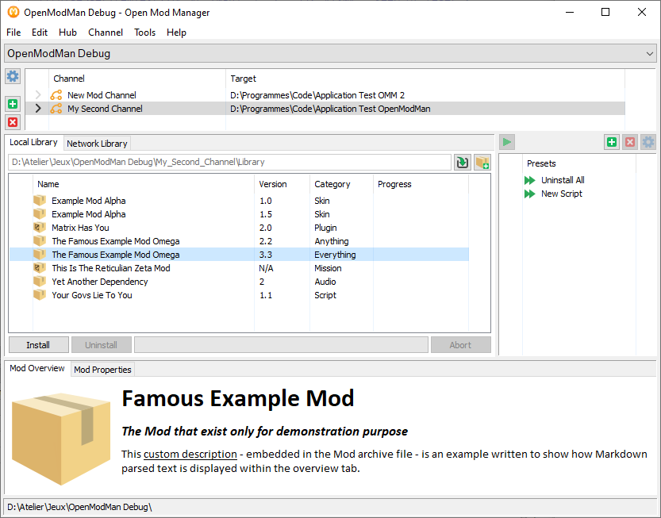

# Open Mod Mananager

Open source and generic Mod ("Modifications") manager.

## Version: 0.9.7 (beta)

## Presentation

Open Mod Manager is an open source and generic Mod manager. Mod term come from
Modification and refers to one or several unofficial files which are added to, or
replace original editor's files of a software (usually a game) to change its behaviour,
add features, components or items.

While these Mods's files can be manually installed and origina files backed by the user,
Open Mod Manager provide a safe, automated and advanced environement to store, install,
back and restore original files, and create Mods as encapsuled packages.

### Modern package management

Cumulative installations, backup then restoration of original files are key feature,
Open Mod Manager embed safe and smart automatic backup mechanism to garantish user can
always and at any time restore editor's original files. Finally, as any modern package
manager, Open Mod Manager support versioning and dependencies mechanisms.

### Network oriented

Since most of mods are provided by users or communities, and downloaded by other, Open
Mod Manager provides an open online repository mechanism allowing any community or
individual to provides its encapsuled packages within public online repositories. Users
can configure repositories to check for updates or new availables packages from their
favorite communities.

### Generic and versatile

Open Mod Mod manager is not focused to work with a specific game or software, it is in
contrary designed to be generic, very flexible, and to adapt to the most configurations
as possible and even for what was not though in the start. The configuration
architecture is modular, stored as human readable XML files. Editing merging or
deleting configuration modules can be as simple as - litteraly - moving subfolders
from one location to another.

## Features

Open Mod Mananager currently implements the following key features:

- Flexible and modular XML and folder configuration logic.
- Multiple installation destinations per configuration context.
- Custom folders for packages (Mods) library and backup per installation destination.
- Support for both folders (legacy) Mods and advanced zipped Packages.
- Smart installation and backup mechanism allowing overlapped installed files.
- Packages installation dependencies mechanism (advanced packages).
- Backup data compressed as zip archives to save space (optional).
- Batch mechanism for automatic Package installation sequences.
- Network repositories for remote packages distribution and download.
- Automatic package dependencies download and fix system.

## Screenshot

## Version history

0.9.8 (not yet released)
- Add support and automatic follow of HTTP redirect responses.
- Fix Network ListView columns click wrongly pops up contextual menu.
- Fix Network ListView not properly redrawn after item sorting.
- Fix Network Abort button not properly enabled at download start.
- Fix Package Editor not properly clear properties of modified existing package.
- New menu and shortcut to load seleted package in Package Editor.
- Fix not working delete repository button of Network tab.

0.9.7
 - Developer mode back as enabled by default.
 - Fix undo install not working with archive files backup.
 - Package created folders no longer generate overlapping.

0.9.6
 - Overall optimization and various debug.
 - Repaired broken Context Wizard dialog.
 - Fix Load Contexts At Startup option dialog not saving properly.
 - New Tools menu for editors.
 - New improved Package editor dialog (moved in Tools menu).
 - New support for .omp extension file as Open Mod Manager Package.
 - Fix Batch properties crash if package no longer available.
 - Batch properties now ask user to clean Batch in case of invalid package reference.
 - Automatic fix Batch inconsistency in case of Context's Location changes.
 - Fix Batch execution thread not properly terminated.
 - Consolidated package algorithms for robust dependencies and overlaps management.
 - Setup now configure the system-wide application files and icons association.
 - Now only one running instance allowed to prevent conflicting usages.
 - New ability to run application and open Context files (.omc) by double-click on it.
 - Moved dev mode and warnings parameters from Manager to Location.
 - New Network repositories feature.
   - New Repository editor to create server side repository definition files.
   - New Location's Network tab to setup client side repositories.
   - New Main Network tab to query online repositories and download remote packages.
   - Automatic dependencies download and fix system.

0.9.5 (2021-05-22)
 - Fix Library list-view scroll position reset to top on refresh.
 - New buttons and dialogs for Batches edition
 - New Discard backups data feature for emergency situations
 - Edit menu modified for quicker access properties

0.9.4 (2020-11-26)
 - Modify Package creation function to add picture file as provided.
 - Fix Package creation dialog crash if no Context loaded.
 - Fix various typo for "Uninstall".
 - Fix Load Contexts At Startup option dialog not saving properly.

0.9.3 (2020-07-21)
 - Update pugixml API to version 1.10
 - Fixed new Context Wizzard custom library and bakcup folder incorrectly created.
 - Fixed multiple bugs in various dialogs.

0.9.2 (2020-07-15)
 - Rewritten Package building algorithm.
 - Fixed Package "Save As" button never enabling.
 - Replace GPL text by credits in the "About" dialog.
 - Rewritten file/directory Access-Control check mechanisms.
 - Improved Unicode and non-ASCII characters support.
 - Fixed incorrect packages list refresh after move to trash.

0.9.1 (2020-07-11)
 - Fixed random string bug and crash caused by buffer overflow.
 - Fixed Context creation wizard not properly reseted after cancel by user.
 - Fixed missing application informations and icons within Windows Application list.
 - Algorithm to check file and folder access permissions slightly modified.

0.9.0 (2020-07-08)
 - First public BETA release
